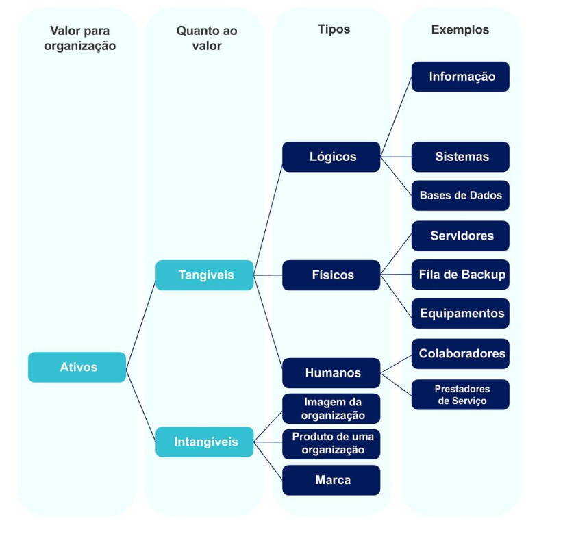
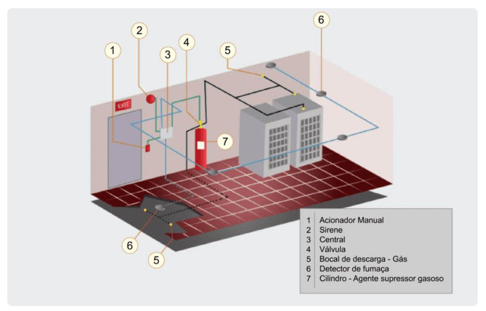
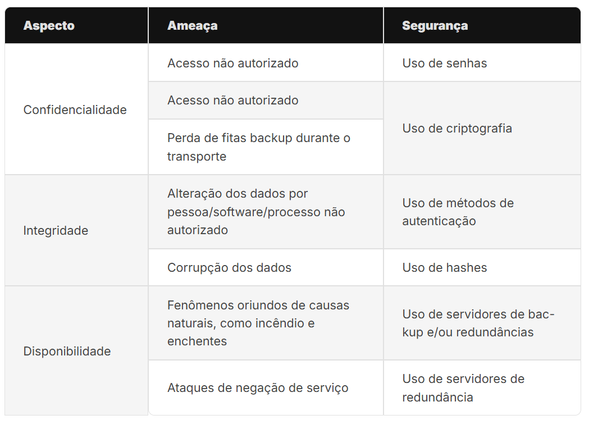
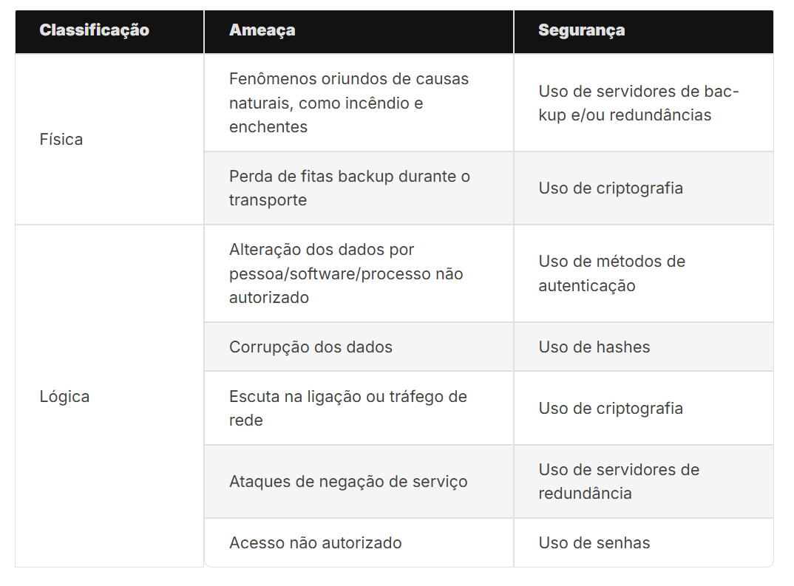
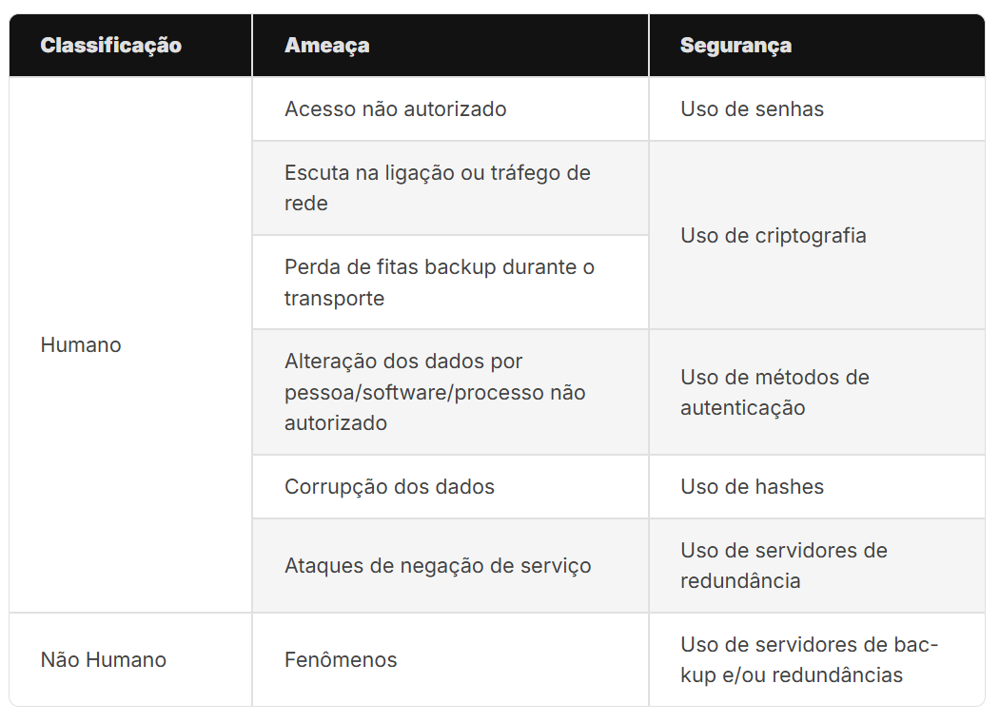
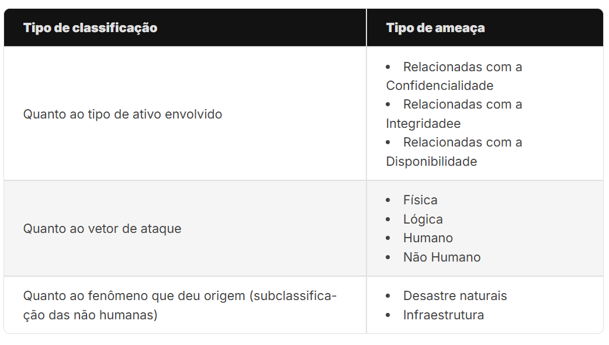

# Ameaças e vulnerabilidades à Segurança da Informação

Conceitos de ameaças e vulnerabilidades, suas classificações e possíveis tratamentos para a mitigação desses problemas. Apresentação de técnicas utilizadas em ataques cibernéticos e exemplos de golpes aplicados na internet.

# Propósito

Compreender a importância de identificar ameaças e vulnerabilidades no âmbito da Segurança da Informação para prevenir os danos causados por ataques cibernéticos.

# Objetivos

- Identificar os conceitos e os tipos de ameaças e vulnerabilidades de Segurança da Informação.
- Identificar técnicas utilizadas em ataques cibernéticos.

# Introdução

Em meados dos anos 1990, nos laboratórios do CERN (Organização Europeia para a Pesquisa Nuclear), na Suíça, o físico britânico Tim Berners-Lee, em seu computador NExT, começou a escrever algumas linhas de código que transformariam a humanidade. E ali nasceu a internet.

Atualmente, não conseguimos passar um momento sem que façamos algumas interações através da grande rede de computadores. Embora esse sistema seja bastante útil, algumas pessoas e situações têm se aproveitado disso para adquirir vantagem ou demonstrar superioridade técnica.

Assim, deu-se início a uma batalha virtual onde hackers de todo o mundo exploram as fraquezas, também conhecidas como vulnerabilidades, de servidores e serviços utilizados por bilhões de pessoas. Por isso, este conteúdo objetiva identificar os conceitos de ameaças e vulnerabilidades de Segurança da Informação e seus possíveis tratamentos. Também serão ressaltados alguns dos golpes mais comuns na internet e apontados caminhos para sua mitigação.

# Ameaças e vulnerabilidades de software

Hoje em dia utilizamos aplicações de software para realizar muitas tarefas como consultar o extrato financeiro, aplicativo de banco, fazer uma compra ou assistir uma aula. Não há dúvidas como essas aplicações são importantes para nós. Exatamente por causa da importância dessas aplicações precisamos nos preocupar com a questão da segurança. Por exemplo, um cliente quer comprar uma roupa na promoção excelente, a loja não é muito conhecida e o nosso cliente enão verifica a procedência dela, ou procurar por comentários de outros clientes a respeito da loja, e resolveu efetuar a compra com seu cartão de crédito informando vários dados pessoais. Os donos da loja são honestos mas usam um sistema sem garantia de segurança para os clientes e nem para eles mesmos. Infelizmente muita coisa ruim pode acontecer nesse cenário. Uma delas é que o invasor pode descobrir falhas no sistema da loja e começar a aplicar golpes que prejudicam os clientes e os lojistas que não possuem uma boa proteção. Os invasores estão na busca por sistemas que não possuem recursos de segurança. Eles exploram defeitos no software para obter o controle no sistema e dos dados. Esses defeitos de segurança no software chamamos de vulnerabilidade, na prática a vulnerabildiade são pontos fracos na segurança do sistema, o expõe ao risco de invasão. Esse risco é o que chamamos de ameaça, portanto ameaça é qualquer coisa que pode explorar uma vulnerabilidade de forma intencional e acidental para obter dados de forma indevida prejudicar o funcionamento correto do sistema. Concretamente alguns exemplos de ameaças são tentaativas de ataques, roubos, acidentes, incêndios e corrupção de dados. Mas vem a questão: como reduzir as vulnerabilidades o software e os riscos de ameaça? A primeira coisa que deve estar clara a respeito da minimização dos riscos em relação às ameaças e vulnerabilidades de software que existem métodos e normas bem definidos, por exemplo a norma abnt código de prática para gestão de segurança da informação trata de todos os aspectos necessários para garantir que todas as práticas sejam aplicadas à segurança da informação. Essa norma aborda questões que tratam o estabelecimento e o gerenciamento de uma política de segurança da informação, tratamento e segurança de recursos humanos físicos e do ambiente, operações e comunicações, controle de acesso, ter uma gestão de incidente de informação e documenta e treina de forma clara a gestão de continidade de negócio.

# Ameaças e vulnerabilidades

Atualmente, a informação é um dos principais ativos das empresas. Por meio das informações, novas tecnologias são obtidas, novos fármacos são ofertados no mercado e salvam vidas. O filme Trocando as Bolas (do inglês, Trading Places, de 1983) ilustra bem essa questão.

O enredo trata de dois corretores bem-sucedidos, os irmãos Duke, que resolvem apostar 1 dólar pela troca de um alto executivo, personagem de Dan Aykroyd, por uma pessoa em situação de rua, interpretado por Eddie Murphy. Com o desenrolar da história, aborda-se o acesso a informações privilegiadas dos irmãos Duke sobre a safra da laranja no mercado norte-americano.

Pensando no contexto atual, imagine, agora, quanto seria o valor de mercado de uma empresa que já tivesse a patente da vacina contra o coronavírus no inicio da pandemia.

As instituições têm o seu valor de mercado calculado a partir de seu market share, produtos, patentes, instalações, bens e informações, ou seja, de seus ativos. Os ativos podem ser classificados como tangíveis, quando é possível medir o seu valor, e como intangíveis, quando é difícil, ou impossível, medir o seu valor.

Ativos intangíveis

São a imagem de uma organização ou um produto. Algumas operadoras de telefonia tiveram a qualidade de seus serviços prejudicada em função de problemas técnicos de cobertura de sinal. Esse “fantasma” assola os corredores dessas empresas. Que campanha pode ser realizada para mudar tal situação? Percebeu o quão intangível é a imagem de uma companhia?

Ativos tangíveis

São aqueles que conseguimos medir. Eles podem ser classificados como lógicos, quando nos referimos a informações ou softwares; físicos, quando nos referimos a equipamentos ou infraestruturas; e humanos, quando nos referimos a colaboradores e prestadores de serviço.

Ativos tangíveis lógicos

São aqueles que envolvem a informação e sua representação em algoritmos, por exemplo, uma fórmula química, os detalhes sobre a safra da laranja no mercado norte-americano, o algoritmo principal de busca do Google, os detalhes técnicos das baterias dos carros do Elon Musk.

Ativos tangíveis físicos

São aqueles que conseguimos tocar, como a usina hidrelétrica de Itaipu, a ponte Golden Gate e o Cristo Redentor. Esses são exemplos de infraestruturas cuja ausência poderá provocar uma perda significativa que ficará marcada na memória. Provavelmente, você se lembra de onde estava no dia 11 de setembro de 2001. Em termos de equipamentos, podemos citar as prensas de papel moeda da Casa da Moeda; o supercomputador Santos Dumont, que permite fazer o sequenciamento do genoma de diversos seres vivos etc.

De maneira geral, os ativos tangíveis e intangíveis se posicionam e se desdobram desta maneira:

A perda ou a danificação desses ativos poderia acarretar problemas financeiros gigantescos.

Exemplo: Vamos analisar o caso da Apple. Em 1997, Steve Jobs (1955-2011) retornou para a Apple e, até o seu falecimento, as ações da empresa aumentaram 9000%. Em termos comparativos, nos últimos dois anos de vida de Jobs, os valores das ações mais do que dobraram, enquanto os da Microsoft subiram 5,1% e os da Intel valorizaram 14% no mesmo período. Quando Jobs faleceu, as ações da Apple tiveram uma queda, não tão acentuada, mas ainda assim uma queda. Trata-se de um claro exemplo de um ativo humano e da perda financeira causada quando ocorre um problema desse tipo. Do mesmo modo, pode ocorrer também a hipervalorização quando um novo ativo é obtido.

Para proteger esses ativos, precisamos criar barreiras de proteção aos diversos tipos de problemas que possam acontecer. Os controles de Segurança da Informação, também conhecidos como medidas de proteção, são as ferramentas, os equipamentos, as metodologias e os processos que usamos para proteger um ativo contra uma ameaça e a(s) sua(s) vulnerabilidade(s) associada(s).

Como relacionar uma ameaça e uma vulnerabilidade? Vamos pensar em um exemplo baseado em um desenho infantil, o Papa-Léguas.

Na animação, o coiote tentava jogar uma bigorna em cima do pássaro, mas vamos trocar nossos atores. Em vez do pássaro, imaginemos um refrigerante, cuja fórmula está salva em um dispositivo de armazenamento externo (pen drive). Nesse caso, a bigorna é uma ameaça contra o nosso dispositivo. Para proteger o nosso pen drive, podemos colocá-lo dentro de uma caixa de metal hiper-resistente. Certamente, criamos uma proteção (controle) contra a ameaça (bigorna).

Vamos agora trocar o pen drive por uma folha de papel. Uma bigorna é uma ameaça contra uma folha de papel? Não necessariamente. Mas o fogo seria uma ameaça antes e continua sendo agora. Então, nesses dois casos, o fogo persiste e provavelmente o controle anterior não protegeria o pen drive nem a folha de papel contra essa ameaça. Podemos perceber, portanto, que, para explorar a vulnerabilidade de um ativo, pode existir uma ou mais ameaças. Da mesma forma, contra uma vulnerabilidade pode haver uma ou mais ameaças.

O ativo corresponde à forma estrelada central. Cada sulco é uma vulnerabilidade que pode ser explorada por uma ameaça. Cada ameaça tem uma chance (probabilidade) de acontecer, representada na imagem pelo tamanho da seta. Assim, há ameaças com grande probabilidade (setas maiores) de acontecer e outras com pouca probabilidade de acontecer (setas menores).

Os semicírculos vermelhos correspondem aos controles que podem proteger o ativo contra uma ou mais ameaças.

Exemplo: Um incêndio e uma enchente são ameaças físicas para um servidor em um data center. Mais do que isso, são pesadelos para os melhores administradores de TIC. Um sistema anti-incêndio com sprinklers, detectores de fumaça, extintores e uma brigada contra incêndio com treinamentos periódicos correspondem a bons controles que podem envolver equipamentos, pessoas e processos.

Antes de continuarmos, é importante sabermos o significado da sigla TIC.

Saiba Mais: TIC significa Tecnologia da Informação e Comunicação. Essa sigla foi utilizada pela primeira vez em uma proposta de currículo escolar elaborado no Reino Unido, no fim dos anos 90. TIC também pode ser definida como um conjunto de recursos tecnológicos utilizados de maneira integrada, tendo como objetivos o processamento de informação e o auxílio na comunicação. A TIC se faz presente na indústria (no processo de automação), no comércio (no gerenciamento, nas formas de publicidade), no setor de investimentos (informação simultânea, comunicação imediata), na educação (como ferramenta de auxílio ao ensino e aprendizagem, na Educação a Distância), dentre outros setores da sociedade.

Em um incêndio, os itens citados são boas formas de proteção. Mas e em uma enchente? Esses controles são totalmente ineficientes. E durante a falta de energia elétrica? Ou mesmo em uma sobrecarga de energia elétrica? O que seria mais usual de acontecer: incêndio, enchente, falta de energia elétrica ou sobrecarga de energia elétrica?

Certamente, isso dependeria de uma análise geográfica do local de instalação do data center.

Se ele estivesse instalado no cerrado nordestino, seria razoável pensar em uma enchente? Ou se o data center estivesse instalado em uma região de mangues mato-grossenses, seria razoável pensar em uma enchente? Ou em uma região da Amazônia conhecida pelo elevado número de descargas atmosféricas que ocorrem por ano?

O correto seria a análise e avaliação dos riscos associados à instalação de data centers na região, devendo obedecer a critérios específicos de probabilidade de ocorrência e sorte, afinal de contas, qual seria a probabilidade de dois aviões colidirem em duas torres de um mesmo prédio?

Veja, a seguir, um sistema de combate a incêndio:

Após a análise e avaliação do risco e a sua probabilidade de ocorrência, podemos adotar uma metodologia como a identificação dos ativos e o cálculo do seu valor. Será mesmo que precisamos usar todo e qualquer controle para proteger o ativo? E se o ativo valer menos do que o controle, ainda seria vantajoso implementar esse controle? Com a definição do valor do ativo, a análise e avaliação do risco e os custos para implementar as proteções necessárias, começam as decisões.

Uma boa comparação está no seguro de um automóvel. Ao contratarmos uma seguradora, o valor da franquia do seguro nos é apresentado. Se ocorrer um sinistro e ele for mais barato do que o valor da franquia, valerá a pena acionar o seguro? Não, pois pagaremos mais caro.
 

Um risco na carroceria é o suficiente para acionar o seguro? E uma batida frontal? E quando o carro sofre perda total? A seguradora decide pagar o valor segurado, pois é mais barato do que mandar consertar.

# Tipos de ameaças e vulnerabilidades - Física e Lógica

Tomando por base esses três aspectos, pode-se classificar alguns tipos de ameaças e os respectivos controles que podem ser adotados.

Nos últimos meses, as ocorrências de pessoas relatando problemas de invasão nas contas de WhatsApp multiplicaram. Esse incidente permite que alguém se aproprie da conta do serviço de mensagem de outra pessoa para pedir dinheiro em nome do dono da conta. Podemos perceber o acesso não autorizado, que poderia ser corrigido pelo uso de senhas, evitando possíveis problemas de alteração de dados, ou pela adoção de métodos múltiplos de autenticação.
 

São exemplos clássicos de perdas de confidencialidade e integridade. Poderá haver recuperação de dados dos usuários por meio de backups realizados pelo sistema. Para esse problema, recomenda-se o uso da confirmação em duas etapas.

Outro exemplo que podemos citar é o armazenamento de documentos eletrônicos. Atualmente, em termos de aplicações que conseguem colocar o rosto de uma pessoa em outra, alterar documentos torna-se uma ação simples de ser realizada. Logo, uma forma de proteger o documento eletrônico é guardar um selo de autenticidade para assegurar que o documento está íntegro. Uma ferramenta bem disseminada é o uso de funções de hashes.

Outra forma de abordar as ameaças descritas é utilizando a classificação quanto a ser física ou lógica. Fenômenos naturais e perdas de dispositivos de armazenamento são exemplos de ameaças físicas enquanto as demais são exemplos de ameaças lógicas.

Podemos reorganizar a tabela anterior e reapresentar as ameaças de acordo com a taxonomia física e lógica, obtendo a seguinte tabela:

Podemos consolidar da seguinte forma: se ocorrer falha em equipamentos e instalações, a ameaça é física. Caso contrário, se estiver relacionada a problemas de software, algoritmos etc., é considerada ameaça lógica.

Quando a ameaça tiver algum agente humano, é classificada dessa forma. Caso contrário, como, por exemplo, nos fenômenos oriundos de causas naturais, como incêndio e enchentes, é conhecida como ameaça não humana. Veremos os detalhes na próxima tabela:

As ameaças humanas são aquelas que foram provocadas por seres humanos, e as não humanas são provocadas pela natureza ou por problemas de infraestrutura. As ameaças provocadas por seres humanos podem ainda ser classificadas das duas formas a seguir:

Colaboradores

As oriundas de colaboradores ou pessoas mal-intencionadas e aquelas oriundas de pessoas ou colaboradores que não possuem o conhecimento adequado (mal treinados). Nesse caso, o colaborador, propositalmente, faz ações que podem provocar incidentes e prejuízos financeiros, seja pela perda de confidencialidade de algum ativo, seja pela adulteração de algum ativo para agente ou processo não autorizado.

Hackers

Os oriundos dos hackers que exploram as vulnerabilidades para demonstrar conhecimento e exibir seu feito para a comunidade; ou ainda pelo simples desafio de alcançar o objetivo, como se fosse um jogo; ou mesmo para obter ganhos financeiros a partir da obtenção de ativos das instituições. Exemplo disso são as notícias que circularam em junho de 2020, quando o governo norte-americano alegou terem sido realizadas invasões para o roubo da pesquisa farmacológica de remédios do coronavírus.

As ameaças não humanas podem ainda ser classificadas em ameaças oriundas de desastres ou de problemas de infraestrutura. Essas ameaças podem ser mitigadas pela gestão do risco envolvido na implantação dos ativos.

Por exemplo, na construção do data center, se a região possui enchentes com certa regularidade, é razoável pensar em alternativas concretas para mitigar esses riscos. A enchente é um exemplo de causa natural. Na contramão, um incêndio causado por uma sobrecarga elétrica é um exemplo de uma ameaça não humana, resultante de problemas de infraestrutura.

Quando a ameaça tiver algum agente humano, é classificada dessa forma. Caso contrário, como, por exemplo, nos fenômenos oriundos de causas naturais, como incêndio e enchentes, é conhecida como ameaça não humana. Veremos os detalhes na próxima tabela:

Essas classificações se sobrepõem e permitem que determinada ameaça possa ser classificada por vários critérios.

Exemplo: Considere uma chuva torrencial em uma região metropolitana, onde tenha um data center implantado. Nosso país, pela sua geografia, possui locais em que há chuvas em determinadas épocas do ano, em especial as chuvas durante o verão no Rio de Janeiro. Trata-se de um problema que ocorre em diversas capitais brasileiras. Se uma rua inundasse, como ficaria um data center? Já imaginou a perda ocasionada por essa ameaça?

No caso de uma inundação em um data center, o principal problema gerado é a disponibilidade. Dependendo dos controles (proteções) escolhidos pelo gestor, até mesmo problemas de integridade dos dados podem ser gerados. Por isso, sempre é necessário realizar a abordagem em camadas. Nesse cenário, alguns controles simples poderiam ser desenvolvidos como:

- Contingência: desenvolvimento de alguma técnica/metodologia para suprir a ausência ou falha do data center.

- Processo e treinamento do uso da contingência.

- Processo e realizações de cópias de segurança, bem como a verificação do status dessas cópias, inclusive com simulação de desastres.

Comentário: Lógico que não é possível esgotar totalmente o assunto, pois várias situações complementares poderão ocorrer e a lista estaria incompleta, mas, por si só, essas seriam as principais abordagens.

Um exemplo de classificação das ameaças, como uma inundação, pode afetar a disponibilidade e/ou integridade (quanto ao tipo de ativo envolvido), é física e não humana (quanto ao vetor de ataque) e causada por desastre natural (quanto ao fenômeno que deu origem).

# Técnicas para ataques cibernéticos

O que é ameaça no contexto da segurança da informação? Ameaça é qualquer agente ue possa corromper ou roubar dados ou interromper o funcionamento de um sistema. Portanto, quando uma ameaça se concretiza ela gera uma ocorrência que pode implicar em diversos problemas, isso vale taanto para sistemas utilizados por organizações ou com aqueles utilizados para uso pessoal. Atualmente, temos diversas formas de combater as ameaças para segurança da informação. Mas também é um fato que essas ameaças continuam evoluindo então para que possamos combatê-las, primeiro precisamos entendes quais são os tipos de ameaças que pode afetar a segurança da informação. Quando uma ameaça deixa de ser uma possibilidade e se transforma em uma ação, ela passa a ser chamada de ataque cibernéico. Os ataues cibernéticos são tentativas concretas que tem como objetivo roubar, expor, alterar, desativar, destruir informações, vamos falar um pouco mais sobre esses ataques. Um dos ataques cibernéticos mais comuns são os ataques de negação de serviço, basicamente é um tipo de ataque que tem por objetivo indisponibilizar determinado sistema ou equipamento,prejudicando a continuidade dos serviço, outro ataque é de engenharia social, nesse tipo de ataque o criminoso primeiro investiga a vítima alvo para entender o seu comportamento e com o objetivo de identificar e explorar potenciais vulnerabildiades de segurança, um exemplo é o fishing: é tipo de ataque que ocorre por e-mail, onde o atacnate envia um e-mail oferecendo uma vantagem para vítima em nome de uma instituição, no e-mail a vítima érinetada que clique no link que é direcionada para um site, quando a vítima entra nesse site e fornece dados pessoais o ataue ocorre com sucesso. Ataqque de pichação de site ocorre quado um atacante faz uma modificação do conteúdo de um site. Ataque de botnet os atacantes usam redes de dispositivos conectados apra realizar vários golpes. Alémd essas técnicas, existem muitas outras usadas em atques cibernéticos, por exemplo, ataque de sequestro de sessão do tcp, nesse caso o atacante usa uma sessão de usuário da web e passa a usar uma identidiade de usuário. Ataques do milware que são programas maliciosos apra ifnectar sistemas, como vírus de computadores. Para reduzir exposição a tantos riscos, é necessário aplicar uma avaliação de riscos para detectar vulnerabilidades, além de estabelecer controle de acesso a rede, uso de firewall e uso de anti-vírus, para amnter os programa as atuaizados e o conrole de tráfego de rede. Investir em treinamento e conscientização de todos.

# Ataques cibernéticos

Definição

Abordaremos as seguintes ameaças cibernéticas: ataques; engenharia social; pichação de sites e softwares maliciosos. Esses tópicos correspondem à maioria das atividades relacionadas com este conteúdo.
 

Sendo assim, deve-se ter em mente que, por mais que possamos explorar esses itens na sua plenitude, eles nunca estarão totalmente completos porque constantemente são criadas novas técnicas e metodologias envolvidas na atividade hacktivista.

As ameaças cibernéticas são concretizadas por meio do uso de técnicas que normalmente exploram a vulnerabilidade de uma tecnologia, de um processo ou de uma metodologia.

No caso de uma vulnerabilidade relacionada à tecnologia, ela se vincula com a forma de desenvolvimento da ferramenta e, certamente, novas versões daquele software trarão a correção adequada. Um bom exemplo disso é o ping da morte (ping of death) que durante muitos anos foi o pesadelo dos gerentes de TI e atualmente não passa de história nos livros sobre segurança.

Ataques cibernéticos são ações maliciosas intencionais, provocadas por hackers ou por funcionários insatisfeitos. Essas ameaças humanas já foram objeto de explicação anteriormente e vimos que as pessoas estão envolvidas. Aqui falaremos do que essas pessoas poderiam realizar.

As razões e motivações já foram explicadas, mas podermos resumi-las ao estímulo de se obter determinada informação (ferindo a confidencialidade), danificar a informação (ferindo a integridade) e interromper o funcionamento de determinado sistema (ferindo a disponibilidade).

No campo do exibicionismo que motiva essas pessoas, podemos exemplificar as informações divulgadas pelo site zone-h, que possui uma lista dos últimos ataques que aconteceram, funcionando como um hall da fama, onde os hackers disputam a quantidade e qualidade dos ataques realizados. Percebe-se que o principal fator é a motivação do hacker em proferir o ataque.

Mas como tornar um serviço indisponível por meio de outro tipo de ameaça que não a humana? Outras situações podem gerar a indisponibilidade do serviço, como enchentes etc. Um simples poste caído devido a uma batida de carro pode gerar uma perda de comunicação e a indisponibilidade do serviço.

De qualquer forma, uma boa análise e a avaliação do risco associado devem ser realizadas buscando o desenvolvimento dos controles associados para a criação da contingência necessária.

Dica: Redundâncias e contingências são sempre úteis e, quando possível, devem sempre ser utilizadas.

Ataques de negação de serviço (DOS)

Corresponde a um tipo de ataque que tem por objetivo indisponibilizar determinado sistema ou equipamento. Ou seja, o equipamento pode até estar funcionando, mas seu uso fica prejudicado pela impossibilidade de acesso ao serviço prestado. Nesse tipo de ataque, são exploradas vulnerabilidades de softwares, de equipamentos e de algoritmos/protocolos.

São exemplos o pod (ping of death), syn flood
udp flood e o tcp flood. Esses ataques exploram vulnerabilidades na implementação de algum serviço de rede, sistema operacional ou protocolo utilizado. Foram muito famosos no início de disseminação desse tipo de ataque e atualmente são utilizados com mais de um agente (fonte), caracterizando assim uma nova classe de ataques, os distribuídos, que é interpretada como uma variante do DOS quando a fonte do ataque é distribuída, ou seja, quando há mais de uma fonte de emissão de sinais de ataques destinados para uma ou mais vítimas.

Antes eram utilizados os mesmos tipos de ataques para cada fonte. Atualmente, é comum encontrarmos situações em que cada fonte possui um tipo de ataque diferente, utilizando vulnerabilidades em implementação, sistema operacional ou protocolo. Assim, fica claro que há uma coordenação que determina a sincronicidade e o momento que os ataques serão proferidos. A necessidade de coordenação tornou urgente o desenvolvimento de uma infraestrutura de ataque e que diversas etapas predecessoras fossem criadas, situação esta denominada botnet.

# Engenharia social

Situação em que são usadas as fraquezas humanas para se obter informação (ferir a confidencialidade) de uma pessoa ou organização.
 

Normalmente, comenta-se que o elo mais fraco, exatamente aquele que poderá ser o primeiro a ser explorado, é o humano.

 

Em uma organização é difícil que todos os colaboradores tenham o mesmo entendimento e a mesma maturidade com relação ao sigilo de informações.

O exemplo mais comum desse tipo de ataque é o phishing, comumente utilizado para obter dados de cartões de crédito, visando ao ganho financeiro.

Ações de phishing podem acontecer de diversas formas. Pode ser um e-mail semelhante ao de uma instituição financeira, um SMS com um link para regularizar uma situação, uma página (ou post) em uma rede social e até mesmo um site inteiro clonado.

Outro exemplo bem comum na década de 1990 eram dispositivos, que possuíam várias formas e partes diferentes, que liam os cartões de crédito (naquela época sem chip) para copiar a tarja magnética. No Brasil, eles ganharam o apelido de chupa-cabra, fazendo menção a uma situação ocorrida em Minas Gerais, que era creditada à presença de alienígenas naquela região, na mesma época da aparição desses mecanismos.

O que chama bastante atenção é o grau de sofisticação usado pelos fraudatários na construção dos dispositivos de fixação e com aparência bem próxima aos dos bancos.

# Pichação de site

Corresponde à técnica mais utilizada e se caracteriza pela alteração não autorizada de determinado site na internet. Também conhecido como defacement, essa técnica objetiva a adulteração do portal, sem o consentimento do proprietário. São exploradas as vulnerabilidades dos portais e, por meio disso, são realizadas as modificações.

Esse ataque é mais popular pela repercussão gerada após a sua realização. É relativamente fácil encontrá-lo em ferramentas de gestão de conteúdos (CMS), onde o proprietário do site apenas customiza determinados assuntos no portal, ou faz uso de plug-ins para ofertar novas formas de interação com o usuário.

Comentário: Inicialmente, apresentamos a imagem do zone-h, onde são exibidas as conquistas de defacement.

Botnets

Também conhecido como rede zumbi, é um conjunto de equipamentos que sofreu um ataque, resultando no controle do equipamento pelo hacker. O ataque é realizado através de um software chamado bot, que explora uma vulnerabilidade do equipamento e faz a instalação nele.

Na botnet, existem alguns equipamentos cuja finalidade é orquestrar o ataque, permitindo a manutenção do sigilo do hacker. Esses equipamentos são chamados de centros de comando e controle. Os bots se assemelham aos worms no que se refere à forma de proliferação, porém divergem por acatarem às ordens dos centros de comando e controle. Através de botnets é possível fazer ataques de negação de serviço, envios de e-mails em massa e vários outros.

# Outros tipos de ataques cibernéticos

- Ataques de Negação de Serviço
- Engenharia social
- ip spoofing
- pharming ou dns cache poisoning
- ip session hijacking
- quebra de senhas 
- hash
- trashing dumpster diving
- wardriving

# Softwares maliciosos

Malwares são softwares maliciosos que objetivam a infecção dos ativos de TI. Nessa categoria, há uma variação muito grande e com diversos tipos. Podemos citar os vírus Cavalos de Troia relacionados com propaganda, ferramentas de suporte usadas indevidamente, exploits e worms.

# Saiba Mais

Cavalo de Troia - inspirado no exemplo histórico que deu origem à técnica, mascara-se um vetor de ataque, normalmente um malware, dentro de um documento ou ferramenta, enganando a vítima do ataque.

Exploits e worms - são as aplicações construídas especificamente para explorar determinadas vulnerabilidades existentes e os worms, muitas vezes confundidos com os vírus, utilizam as estruturas de comunicação para sua disseminação.

Há divergências entre as formas de classificação dos tipos de malwares. Porém, de maneira geral, pode-se dizer que os vírus são os malwares que precisam de um ambiente para a sua execução.

Os vírus relacionados com propaganda, como os spywares (por exemplo, aplicações que capturam tudo o que é digitado pelo usuário, conhecidas como keyloggers) e adwares (aplicações que trazem propaganda para o usuário, sem sua autorização) monitoram o usuário de alguma forma, visando explorar o aspecto comportamental humano.

Ainda há o uso mal-intencionado de ferramentas de suporte, como sniffers (farejadores) de rede e port scanners. O primeiro permite analisar o tráfego de rede e o segundo permite verificar quais são as portas de comunicação dos protocolos da camada de transporte que estão disponíveis para conexão.

# Ransomware

Software malicioso, com alto poder de reprodutibilidade, que invade a máquina da vítima, criptografa os seus dados e solicita um resgate. Nos últimos anos, esse tipo de ataque tem sido bem frequente, tendo como caso emblemático o WannaCry.